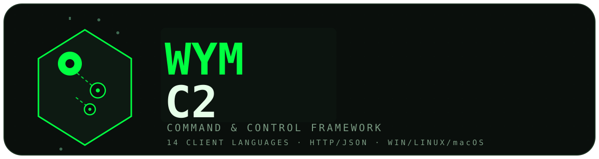
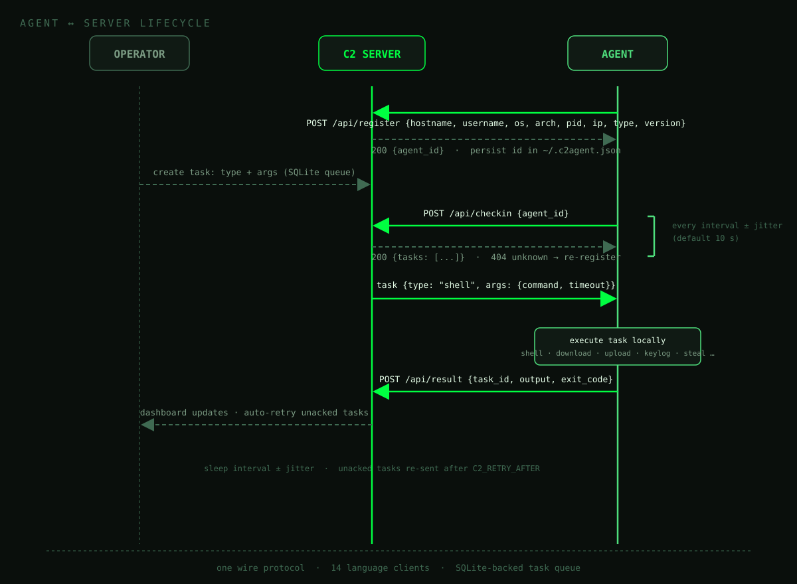

# Wym C2

<p align="center"></p>

Wym C2 are What you missed is Command and Control Frameworks:

- **Server** — FastAPI + Jinja2 dashboard + SQLite (no external DB server)
- **Clients** — agents for Python, Node.js, Bash, PowerShell, Lua, PHP, Perl,
  Ruby plus compiled Go, Rust, C, C++, C# and Java (Windows, Linux, macOS)
- **Protocol** — plain HTTP/JSON, fully documented in [`PROTOCOL.md`](PROTOCOL.md)
- **Docs** — [`AGENTS.md`](AGENTS.md) (client/agent guide),
  [`DEVELOPMENT.md`](DEVELOPMENT.md) (build & run), [`SKILL.md`](SKILL.md)
  (editing this codebase)

> [!WARNING]
> This is a **dual-use security tool**. Use it only against systems you own or
> have explicit written authorization to test. It contains **no evasion and no
> stealth**: a plain HTTP dashboard, a plaintext-friendly wire format, and no
> attempt to hide from EDR/AV. Default Defender/AMSI will flag the PowerShell
> agent. The operators assume no liability for unauthorized use.

## Key Learnings

Trace one `checkin → task → result` round trip and you understand the skeleton
of SOAR/SIEM/XDR/EDR agents, multiplayer client-server loops and remote sensor
fleets:

- **A wire protocol is the source of truth** — one spec with frozen JSON
  shapes keeps 14 language implementations swappable without backend changes.
- **Persistent identity + graceful recovery** — the agent persists its id and
  re-registers on `404`; a lost server-side record never bricks the fleet.
- **Polling beats pushing** — jittered heartbeats with per-task timeouts keep
  a NAT-friendly, outbound-only channel.
- **Every remote action is a durable job** — dispatch → execute → report →
  acknowledge → retry-unacknowledged turns any action into an idempotent
  queue item (the backbone of CI runners and fleet management).
- **Self-healing watchers** — the `clone` task relaunches a stale/dead target,
  the same watchdog trick as auto-restart for game servers and EDR agents.
- **One contract, 14 runtimes, 3 OS families** — shell quoting, HTTP clients,
  input/windowing APIs and path quirks per platform. A spec survives a port
  only when it is small and its defaults are boring.

## How it works

<p align="center"></p>

1. **Register** — the agent posts identity (`hostname`, `username`, `os`,
   `arch`, `pid`, `ip`) and keeps the returned `agent_id`.
2. **Check in** — every `interval ± jitter` s it asks for tasks; `404` → it
   re-registers.
3. **Execute & report** — each task returns `{task_id, output, exit_code}`;
   unacknowledged tasks are re-sent after `WYM_RETRY_AFTER`, so handlers must
   be idempotent.
4. **Manage** — operators queue tasks from the dashboard and watch agents go
   `alive → stale → dead`.

## Features

- Register / checkin / tasking / result reporting per `PROTOCOL.md`.
- Task types: `shell`, `download`, `upload`, `keylog`, `sleep`, `exit`,
  `clipboard`, `screenshot`, `steal` (env/creds/browser DBs → `steal.zip`),
  `clone` (self-heal watcher), `persistence`, `lateral`.
- Per-agent **notes**, task **re-queue**, auto-retry, live metrics, filters.
- **Generate Agent** page — ready-to-run one-liner + installer for every
  language, with an **obfuscate** toggle (AES-256-CBC, key fetched at runtime
  via `/api/obfkey?token=...`).
- **Build on server** — cross-compile Go/Rust/C/C++ (.exe/.out) and Java
  (cross-platform **JAR**); C# is **Windows-only** (`win_x64`/`win_x86`).
- **Mobile agents** — Android **APK** (Gradle + SDK) and iOS **IPA**
  (macOS + Xcode), built fully server-side with a custom artifact name and a
  disguise launcher icon (PDF/DOCX/XLSX/PPTX/ZIP/RAR) rendered by
  `server/icons.py`. Missing toolchains fail fast — never a fake artifact.
- Jitter support everywhere; authenticated dashboard (PBKDF2 + sessions);
  shared-secret `X-Agent-Token` agent auth; SQLite storage, zero config.

## Layout

```
Wym C2/
├── server/               FastAPI app
│   ├── main.py           routes: agent API + dashboard + build pipeline
│   ├── database.py       SQLite schema/helpers (per-OS DB in server/)
│   ├── auth.py           password hashing, sessions, CSRF
│   ├── icons.py          mobile disguise-icon rendering (no image deps)
│   ├── templates/ static/ shared/ collected/ builds/
│   └── tests/            pytest suite (test_api.py, test_mobile.py)
├── clients/              agents (.py .go .cs .rs .java .js .php .rb .pl
│   │                     .lua .ps1 .sh .c .cpp) + agent-service.* + mobile/
│   └── mobile/           android/ (Gradle, com.wym.c2) + ios/ (swiftc)
├── install.ps1 / install.sh / uninstall.ps1 / uninstall.sh
├── dotnet-install.sh     SDK bootstrap (no root, ~/.dotnet)
├── AGENTS.md PROTOCOL.md DEVELOPMENT.md SKILL.md
└── requirements.txt
```

## Server setup

**Windows** — `.\\install.ps1` (default port **8000**, DB `server/wym.db`):

```powershell
.\install.ps1                       # interactive; random password printed
.\install.ps1 -Password "a-strong-password"
```

**Linux / macOS / BSD / WSL** — `./install.sh` (default port **8001**, DB
`server/wym_wsl.db`):

```bash
./install.sh --help
./install.sh -p "a-strong-password"
```

Installers validate config, detect builder toolchains, create platform venvs
(`.venv` Windows / `.venv-wsl` Unix) and print missing-toolchain install
commands. Uninstall via `uninstall.ps1` / `uninstall.sh` (removes only the
matching OS artifacts).

Manual:

```bash
cd server && python -m venv .venv            # Unix: .venv-wsl
.venv\Scripts\activate                        # Windows: pip install -r ..\requirements.txt
pip install -r requirements.txt
$env:WYM_PASSWORD = "a-strong-password"      # Windows; pin it to avoid a random boot password
python main.py
```

Open `http://127.0.0.1:8000/login` (port 8001 via `install.sh`). Server env
knobs are listed in [`DEVELOPMENT.md`](DEVELOPMENT.md).

## Running an agent

```powershell
$token = (Get-Content server\.agent_token).Trim()   # Unix: server/.agent_token_wsl
python clients\agent.py --server http://127.0.0.1:8000 --token $token --interval 10 --jitter 2 --verbose
```

Or via the **Generate Agent** page one-liner / installer for any language.
All 14 agents share the same flags (`--server --token --interval --jitter
--state --verbose`) and the `WYM_*` env fallbacks (`WYM_SERVER WYM_TOKEN
WYM_INTERVAL WYM_JITTER WYM_STATE_FILE WYM_VERBOSE`), plus `-h`/`--help`.

### As a service

- **Windows:** `clients/agent-service.ps1` — single-file, actions
  `install/start/stop/restart/status/uninstall/relaunch/watch`, auto-detects
  the runtime, `--token=TOKEN` for minus-fussy parsers.
- **Linux/macOS:** `clients/agent-service.sh` — systemd (or cron/launchd)
  unit, `Restart=always` / `KeepAlive`-style behavior.

## Dependencies

- **Server:** Python 3.10+ + `requirements.txt` (`fastapi`, `uvicorn`,
  `jinja2`, `python-multipart`, `pycryptodome`, `psutil`, ...).
- **Build toolchains** (only when compiling on the server): `go`, `cargo`,
  `gcc`/`g++` + libcurl, .NET SDK, a JDK, Gradle + Android SDK, Xcode (iOS).
  Rust on Linux additionally needs autotools + X11/input dev headers (see
  [`DEVELOPMENT.md`](DEVELOPMENT.md)).
- **Agent runtimes** exist on the target, not the server: `curl`+`jq`
  (bash), `luasocket` (lua), Python `pynput` (optional keylog), `xclip`,
  `scrot`, `sshpass` (Linux task helpers).

## Security notes

- Use HTTPS (reverse proxy, or `uvicorn --ssl-keyfile/--ssl-certfile`); the
  wire protocol is plaintext.
- Rotate the agent token by deleting `server/.agent_token{_wsl}` and
  restarting (agents must re-register).
- The dashboard enforces CSRF on all POST forms but is meant for a trusted
  network — bind to a management interface/firewall/VPN.

## License / stance

Provided for security education, research and authorized engagements. Use
responsibly.